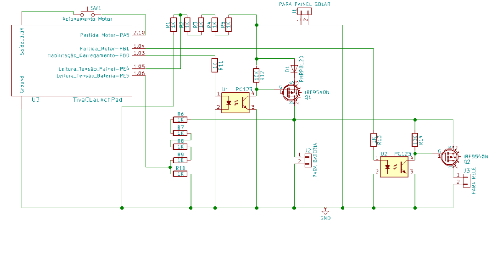

# Solar-powered, Assistive Tricycle

Nowadays, the use of electric bicycles as a means of transport has been highlighted in
society; hybridpowered vehicles that can be driven by both user and electric power offer an excellent
alternative for individuals who wish to move around using a trade-off between transportation 
using some assistance and practicing physical exercise. Similarly, the use of solar
energy to obtain electric energy has been intensively studied and improved, due to the
practically infinite abundance of its matrix resource; new policies of clean and conscious
generation have been increasingly valued by governments, industries and social entities.

This short document aims to briefly describe the development of a system that uses assistive technology powered by
solar energy to drive a 2-seat tricycle. By the use of a solar panel, the prototype transforms the captured solar 
energy into electrical energy, storing it into a battery; this energy is then used to drive an electric starter
motor, which has the purpose of introducing the movement of the assembly.

The system described above is controlled electronically, through a microcontroller manufactured in 
ARM architecture coupled to a launchpad, which has the function of monitoring
and activating the various components employed. In the programming implementation,
the CMSIS (Cortex Microcontroller Software Interface Standart) standard was used.

The circuit schematic can be seen bellow:

The project's documentation, writen in portuguese, can also be found in this repository.
